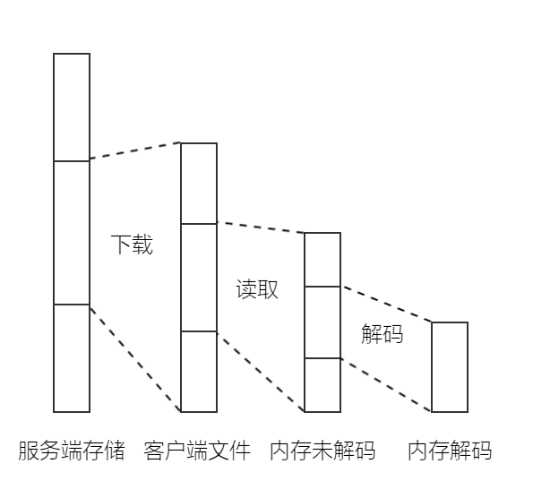
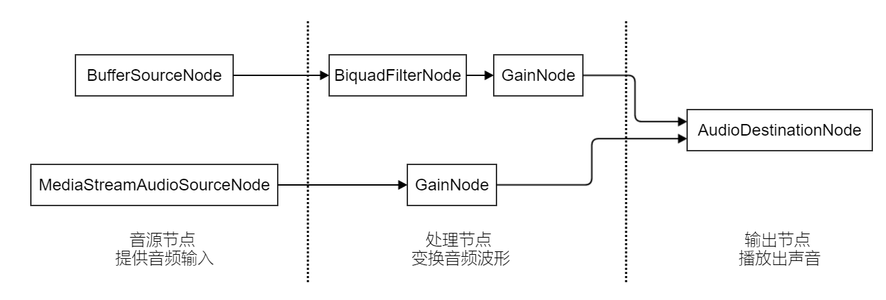

# HTML5 音频库实现

- NaNuNoo
- 2016-08-30
- https://fenqi.io/coding/html5-yin-pin-ku-shi-xian/


音频是游戏中不可或缺的重要组成部分。虽然音频库的实现不如图形库那么复杂，但是对比还算丰富的 WebGL 资料和图形库实现，HTML5 音频库的资料与实现方面的资料明显缺乏。 

本文介绍如何实现一个针对 2D 游戏的音频库，可以播放 BGM、音效和人物对话，尽量做到播放流程无卡顿，均衡网络传输与内存、CPU 占用。

音频库还提供两个额外功能：音频打包（Sound Sprite），BGM 与游戏动画同步的功能。

音频库对于运行环境的最低要求是支持 Audio 元素（要求不同 Audio 元素能够同时播放不同音频）。为了达到最优的效果，WebAudio 的支持必不可少。

## 总体设计

以下列出了设计音频库时优先考虑的功能点：

+ 区分音频资源类型。

  不同音效播放时长区别很大，长如 BGM 可以持续几分钟，短如音效一般仅几秒。针对不同类型的音频缓存与解码策略大不相同，音频资源应当分为几种来管理。

+ 控制网络传输与内存占用。

  游戏属于各种资源都比较紧张的应用，网络带宽与内存占用都是热点资源。

  此外，音频库使用者可能希望尽量精细地控制音频的行为，例如：何时解码音频，何时下载音频资源，音频资源下载的优先级等。

+ 向下兼容。

  在支持 Audio 元素（要求不同 Audio 元素能够同时播放不同音频）的环境中，音频库优先保证功能可用，Audio 模拟实现部分 WebAudio 功能。

  WebAudio 的支持则可以完全发挥出音频库的效能。

综上，音频库采用音频资源对象与播放器相分离的设计，使用者先创建音频资源对象，再将资源传递给播放器播（AudioPlayer）放声音。音频资源对象分为两种：长音频（StreamWave）主要针对 BGM。短音频主（BlockWave）要针对音效与对话，短音频可以是解码的也可以是未解码的。资源下载、缓存、解码由音频资源对象控制。播放、暂停、音量、混音由播放器对象控制。

## StreamWave 长音频

StreamWave 适合作为流媒体（stream media）来处理。

流媒体是指像音乐、视频网站上，那些文件较大，内容时间长的音视频资源。流媒中经常涉及音频流、视频流的概念，这里的流参考 C 语言中的文件流理解。

仅说对音频库会涉及到的部分，客户端处理流媒体的方法可以理解为一个多级缓冲。



当前正在播放中的一小段音频（小于 1 秒）以解码后的形式存放于内存中；前后临近的一段音频（30 秒左右）以未解码形式存放于内存中供快进快退使用；一下载的音频存放于本地文件，用于缓存；完整的音频存在于服务器。

如果使用 C 语言，这些缓冲区需要自己动手实现。幸运的是在 JS 中，浏览器为我们处理了这些工作。在 [HTML5 音频踩坑](http:/fenqi.io/program/HTML5-yin-pin-cai-keng/article.html)中曾提到，Audio 元素本身就是为在浏览器中播放流媒体而设计的。WebAudio 没有提供独立的流媒体接口，反而借用了 Audio 元素解码流媒体。WebRTC 专为音视频传输而设计，可杀鸡焉用牛刀，并且 WebRTC 浏览器支持情况感人（2016 年）。因此我们选用 Audio 元素实现 StreamWave。

Audio 元素的基础用法是这样的：

```javascript
var audio = new Audio();
audio.src = "stream_wave.mp3";
audio.play();
// listen some event or do something you like
// ......
audio.pause();
audio.src = "";
```

Audio 元素音频加载与播放是一体的，都由 Audio 对象管理，这不符合资源对象与播放器对象相分离的设计要求，需要对 API 进行改造。

```javascript
function StreamWave() {
    this._audio = new Audio();
    // some other StreamWave fields ...
};
function newStreamAudioAsync(url, callback) {
    var streamWave = new StreamWave();
    streamWave._audio.src = url;
    streamWave._audio.preload = "auto";
    streamWave._audio.addEveneListener("canplaythrough", function(){
        streamWave._audio.preload = "none";
        callback(streamWave);
    });
}
function StreamWave.prototype.isPlaying() {
    return streamWave._audio.paused;
}
// some other StreamWave methods ...

var player = {
    _streamArray: [],
    play: function(streamWave) {
        if (!streamWave.isPlaying()) {
            this._streamArray.push(streamWave);
            streamWave._audio.play();
            streamWave._audio.preload = "auto";
        }
    },
    stop: function(streamWave) {
        if (streamWave.isPlaying()) {
            var index = this._streamArray.indexOf(streamWave);
            this._streamArray.splice(index, 0);
            streamWave._audio.pause();
            streamWave._audio.preload = "none";
        }
    },
    stopAll: function() {
        this._streamArray.foreach(function(streamWave){
            streamWave._audio.pause();
            streamWave._audio.preload = "none";
        });
        this._streamArray = [];
    },
    // some other Player methods or fields ...
}
```

StreamWave 的实现很简单，Audio 帮我们做了大部分工作。以上代码基本说明 StreamWave 的原理。

StreamWave 里封装了 Audio 元素，每一段音频都对应唯一的 Audio 元素，这样方便单独控制每段音频的加载进度。新创建的 StreamWave 不要求加载完全部数据，但至少保证流畅播放（依据 canplaythrough 事件）。

player 是一个单例，所有 StreamWave 经由 player 播放。除了以上写出的函数，player 还应提供音量控制，暂停、恢复等功能。

游戏中的 BGM 几乎不存在快进、快退的需求。我们核心的缓存策略很简单，一但 StreamWave 可以流畅播放，我们立刻暂停 StreamWave 加载，为游戏其他部分让出网络带宽。播放中的 StreamWave 开启 preload，缓存更多数据以保持流畅播放。实际实现时，可以让用户选择某一段音频在非播放状态下是否继续加载。

另外，在浏览器支持 WebAudio 的情况下，建议将 Audio 对象的输出连接到 WebAudio 统一控制播放。

```javascript
var webAudio = new AudioContext();
var audio = new Audio("stream_wave.mp3");
var waSource = webAudio.createMediaElementSource(audio);
waSource.connect(webAudio.destination);
```

以上代码，从 Audio 元素 创建音源 waSource，再将 waSource 和 WebAudio 的输出节点 audioCtx.destination 连接起来。看起来，和直接播放 Audio 元素区别不大，不要忘记 WebAudio 拥有强大的音频处理能力，借助 WebAudio 能够实现淡入淡出等音频特效。

## WebAudio 简介

WebAudio 比 Audio 元素复杂一些，对应到 C/C++ 中相当于 Android 的 OpenSL，Windows 上的 media foundation（仅限音频部分）。

本文实现的音频库中不会用到复杂的音频处理节点，用一张图讲概括下 WebAudio 的基本原理。



如上图所示，WebAudio 将音频的处理抽象为一堆节点，这些节点具有输入或输出，音频像水流一样流过这些节点，最终得到处理好的音频。

WebAudio 提供三大类的节点：

+ 音源节点：音源节点采集或解码音频，提供音频输入，1 个输出，没有输入。
+ 处理节点：处理节点变换、合成音频波形，至少有，1 个输入，1 个输出。
+ 输出节点：播放、编码、输出处理好的音频，n 个输入，没有输出。

想象水管中的水流。音频从音源节点流入，沿箭头所指方向，流经处理节点，最终到达输出节点。音频流经的处理节点会对音频波形做指定的变换，程序员要做的只有创建节点，把节点连接起来。

## BlockWave 短音频（WebAudio）

BlockWave 用于处理可以完全保存在内存中的短音频，一般小于 45 秒，最多不建议超过 1 分钟。

```javascript
// var webAudio = new AudioContext();
function BlockWave(url) {
    this._url = url;
    this._encBuffer = null;
    this._decBuffer = null;
    // some other BlockWave fields ...
}
function newBlockWaveAsync(url, decFlag, callback) {
    var blockWave = new BlockWave();
    blockWave._url = url;
    var xhr = new XMLHttpRequest();
    xhr.open('GET', url, true);
    xhr.responseType = 'arraybuffer';
    xhr.onload = function() {
        if (!decFlag) {
        	blockWave._encBuffer = xhr.response;
            callback(blockWave);
        } else {
            webAudio.decodeAudioData(xhr.response, function(decBuffer) {
                blockWave._decBuffer = decBuffer;
                callback(blockWave);
            }
        }
    }, onError);
    xhr.send();
}
// some other BlockWave methods ...
```

使用 newBlockWaveAsync 创建 BlockWave，解码通过 webAudio.decodeAudioData 函数进行。出于节约资源的考虑，decFlag 参数让用户选择是否理解解码音频。未解码的音频存放在 _encBuffer，已解码的音频存放在 _decBuffer，保存音频的 _url 作为 ID 下面会用到。

事实上音频是一种压缩率很高的资源，以大小 1M，比特率 256kps，频率 44100Hz，双声道文件为例，解码为 float 型缓冲，解压后的约大小为 10.7M。如果音频文件比特率更高解压后占据的内存会更大。WebAudio 没有提供部分解码的接口，一段音频要么全解码，要么不解码。

一般来说，常用的音效文件，用户希望解码后常驻内存。单次播放后即等待销毁的对话音频则不然。

再来看播放器：

```javascript
// var webAudio = new AudioContext();
function Player() {
    this._cacheArray = [];
    this._maxCacheSize = 1024 * 1024 * 32;
    this._cacheSize = 0;
    // some other Player fields ...
}
Player.prototype._findCache(url) {
    for (var idx = 0; idx < this._cacheArray.length; ++idx) {
        var cache = this._cacheArray[idx];
        if (cache.url === url) {
            this._cacheArray.splice(index, 1);
            this._cacheArray.unshift(cache);
            return cache;
        }
    }
    return null;
}
Player.prototype._insertCache(url, encBuffer) {
    var thiz = this;
    webAudio.decodeAudioData(encBuffer, function(decBuffer) {
        var cache = {
            url: url,
            decBuffer: decBuffer,
        };
        thiz._cacheArray.unshift(cache);
        thiz._cahceSize = thiz._cahceSize + decBuffer.length * decBuffer.numberOfChannels * 4;
        while (thiz._cahceSize > thiz._maxCacheSize) {
            var popCache = thiz._cacheArray.pop();
            var size = popCache.decBuffer.length * popCache.decBuffer.numberOfChannels * 4;
            thiz._cahceSize = thiz._cahceSize - size;
        }
    });
}
Player.prototype._play = function(buffer) {
    var waSource = webAudio.createBufferSource();
    waSource.buffer = buffer;
    waSource.connect(webAudio.destination);
    waSource.start();
    wsSource.onended = function() {
      	waSource.disconnect();
    }
    return function() {
      waSource.stop();
      	waSource.disconnect();
    }
}
Player.prototype.play = function(blockWave) {
    if (blockWave._decBuffer) {
      	return _play(blockWave._decBuffer);
    } else {
        var buffer = this._findCache(url);
        if (!buffer) {
           buffer = this._insertCache(url, blockWave._encBuffer);
        }
      	return _play(blockWave._decBuffer);
    }
}
// some other Player mrthods ...
var player = new Player();
```

调用 player.play 播放音频，该函数会返回一个的函数，调用返回的函数可以停止音频播放。

实际播放音频的代码在 player.\_play 中。对于已解码音频直接播放，未解码音频先解码再播放。

为了保持示例的简单，player.\_play 没有调用 WebAudio 高级的功能，音量控制、淡入淡出等功能 WebAudio 实现难度都不大，可以在实际音频库中自行实现。

为了避免每次都解码音频，player.\_insertCache 与 player.\_findCache 实现了一套简单的缓存机制，将最近使用过的解码音频缓存起来，最久未使用的解码会在超出缓存上限时自动删除。实际实现音频库时可替换为更完善的缓存机制。

## BlockWave 短音频（Audio 元素）

为了向下兼容，使用 Audio 元素实现 BlockWave 的基础支持。

Audio 元素属于比较重型的 JS 对象，创建太多 Audio 元素可能影响游戏的整体效率，不能采用 StreamAudio 中 Audio 元素与音频资源一一对应的方式。

问题是 Audio 元素只能播放 URL，不能直接播放 ArrayBuffer 中存储的音频资源，可以使用 Blob API 将 ArrayBuffer 转换为 Blob URL。

```javascript
// var webAudio = new AudioContext();
function BlockAudio(url) {
    this._url = url;
  	this._blob = null;
// some other BlockWave fields ...
}
function newBlockWaveAsync(url, decFlag, callback) {
    var blockWave = new BlockWave();
    blockWave._url = url;
    var xhr = new XMLHttpRequest();
    xhr.open('GET', url, true);
    xhr.responseType = 'arraybuffer';
    xhr.onload = function() {
        blockWave._blob = new Blob([xhr.response]);
    }, onError);
    xhr.send();
}
// some other BlockWave methods ...
```

从服务端获取音频数据后，直接将音频转化为 Blob，其他部分不变。下面是播放器。

```javascript
// var webAudio = new AudioContext();
function Player() {
    this._idleAudioArray = [new Audio(), new Audio(), new Audio()];
    this._busyAudioArray = [];
    // some other Player fields ...
}
Player.prototype._newAudio = function() {
    if (this._idleAudioArray.length > 0) {
        return this._idleAudioArray.pop();
    } else {
        return null;
    }
}
Player.prototype._delAudio = function(audio) {
    audio.src = "";
    var idx = this._busyAudioArray.indexOf(audio);
    this._busyAudioArray.splice(idx, 1);
    this._idleAudioArray.push(audio);
}
Player.prototype._play = function(audio, blob) {
    audio.src = URL.createObjectURL(blob);;
    audio.play();
    var thiz = thiz;
    audio.onended = function() {
        thiz._delAudio(audio);
    }
    return function() {
        audio.stop();
        thiz._delAudio(audio);
    }
}
Player.prototype.play = function(blockWave) {
    var audio = this._newAudio();
    if (audio) {
        this._play(audio, blockWave._blob);
    }
}
// some other Player methods ...
```

创建一个 Audio 元素的对象池，代码中以 3 个为例，最多同时播放 3 个音效，实际实现时可以根据需要动态分配。

这里的 Blob URL，不是先在 BlockWave 对象中创建好，而选择播放时临时创建，避免了 HTML5 音频踩坑中提到的，多个 Audio 元素不能同时播放一个 URL 的问题。

## 音频精灵（Sound Sprite）

实现音频精灵的难点在于 Audio 元素，依然是多个 Audio 元素不能同时播放一个 URL 的问题，WebAudio 实现的音频精灵不能回退到 Audio 元素。

考虑为什么要将散装的资源打包。纹理打包一来可以减少网络请求次数，二来减少 OpenGL  draw call 纹理切换次数，提高渲染效率。音频打包不同，音频没有 draw call 的问题，唯一的目的是减少网络请求次数，音频精灵仅仅是音频打包手段。

可以将音频文件直接拼接，而不是合成一个整的音频文件。以 arraybuffer 形式传输到浏览器，再裁剪回原本的音频文件，交给 BlockWave 处理。

```javascript
function unpackSoundSprite(arrayBuffer, configJson) {
    var byteBuffer = new Uint8Array(arrayBuffer);
    for (name in configJson) {
        var range = configJson[name];
        var soundSprite = byteBuffer.subArray(range[0], range[1]);
        // do anything you like ...
    }
}
```

## 音画同步

音画同步可以让动画踩着 BGM 的节奏点播放，是一个强大的功能。游戏中可能同时播放多个音频，参考现实需求，仅考虑将画面同步到某一个 BGM 的情况。

视频类应用音画同步的方式有三种：音频时间为基准，画面同步到音频；画面时间为基准，音频同步到画面；系统时间为基准，音频、画面全部同步到系统时间。三种方式都可以，要注意一些小坑。

音频播放的时间进度可以直接查询或是监听 timeupdate 事件。可能会想到的设计是用当前同步的媒体时间直接作为系统时间传入游戏引擎的 tick 函数。要小心 timeupdate 事件之保证每秒调用 4-60 次，可能低于游戏主循环 tick 的速度，因此不能直接用媒体时间作为游戏时钟。

```js
function mianLoop(gameTime) {
    if (gameTime < musicTime) {
        incGameSpeed();
    } else {
        if (gameTime - musicTime < 3) {
            decGameSpeed();
        } else {
            pauseGame();
        }
    }
}
```

以音频时间为基准，画面同步到音频为例。比较好的做法是加一个容差 3 秒，游戏主循环内将画面时间与音频时间比较，如果音频快画面慢，就加快画面播放速度；如果画面快音频慢，切差值小于 3 秒，就降低画面播放速度；大于 3 秒可能是因为音频由于网络问题中断了，则暂停画面等待音频缓冲。

## 更多

至此音频库基本完成。

出于兼容性考虑，音频库混用了 Audio 元素与 WebAudio 俩个套 API。这有始终有点怪异，有点像在游戏中混用 Canvas2D 与 WebGL 的感觉。

这个音频库对于 2D 游戏来说已经足够好了，但没有考虑如何将音频放入 3D 场景中，也没有考虑音频的合成与滤波等音频特效。

音频处理是一个不比图像处理简单多少的话题。

实现 3D 音效需要将音频管理融入到 3D 场景，即游戏引擎之中，这又是一个需要花时间讨论的话题。

不实现这些，一方面是为了避免复杂性，保持音频库相对独立与简单，另一方面则是浏览器对 WebAudio 的支持还不够广泛。

换个角度，WebAudio 对于 3D 音效与音频特效已经有了不错的支持，假以时日 WebAudio 也会像 WebGL 一样流行开来，完全基于 WebAudio 实现的音频库会对以上功能提供更好的支持。

