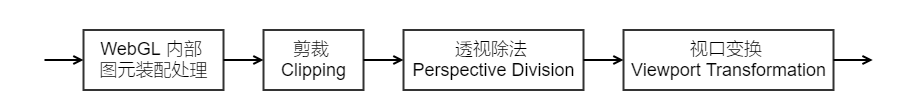
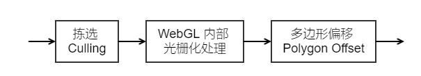

# WebGL 管线全流程及相关函数

- NaNuNoo
- 2016-11-27
- https://fenqi.io/coding/webgl-guan-xian-quan-liu-cheng-ji-xiang-guan-han-shu/


最近想把 FenQi.Engine 的渲染系统从原始的 WebGL 直接调用替换为材质系统。一来是方便合并 DrawCall，二来统一管理 WebGL 绘制状态，三来提供一个 JSON 的材质格式。

为此，比照 WebGL reference card 把涉及绘制管线的每个函数都复习了一遍，整理成本文。

阅读本文前，需要对 WebGL 有一定了解。本文按 WebGL 渲染管线顺序，依次描述 WebGL 函数功能，并提供一些复杂操作的伪代码（如：模板测试、深度测试等），可作速查手册。鉴于 OpenGL ES 2.0 和 WebGL 的相似性，OpenGL ES 2.0 亦可参考本文。

## WebGL 绘制管线

绘制管线是一套非常复杂的系统。

## 顶点着色器 Vertex Shader

顶点着色器的输入包括：

- 顶点缓冲区数据，以 attribute 形式。
- 着色器数值常量，以 uniform int、uniform vec3、uniform mat4 等形式。
- 可选的纹理数据，以 uniform sampler2d、uniform samplerCube 等形式。

顶点着色器的输出包括：

- 顶点数据，储存在 gl_Position、gl_PointSize、以及 varying 变量中。

顶点着色器在输入的每一组顶点数据上执行一次。以绘制矩形为例：

- 直接输入 6 个顶点时，顶点着色器执行 6 次。
- 输入 4 个顶点配合 6 个索引时，顶点着色器执行 4 次。

因此为了提高效率，输入的顶点数量应尽可能地少，可以使用顶点索引、三角条带、三角扇形等优化绘图。另外，裁剪阶段是在顶点着色器之后执行的，所以裁剪不能减少顶点着色器的执行次数。

顶点着色器没有直接相关的函数。着色器操作函数、缓冲区操作函数、uniform 传递函数、attribute 传递函数，都是常用函数，不一一例举。

## 图元装配 Primitive Assembly

图元装配阶段输入顶点数据、顶点索引数据，输出图元数据。还进行一些裁剪与坐标变换操作。

图元装配阶段程序员能控制的部分比较少，内部图元装配依照 gl.drawArrays、gl.drawElements 中传入的参数拼装成点、线、三角形。该过程全部由 WebGL 内部处理，程序员不能干预。

程序员可操控的子阶段包括剪裁（Clipping）、透视除法（Perspective Division）、视口变换（Viewport Transformation）。执行顺序是：输入顶点数据 => 内部图元装配 => 剪裁 => 透视除法 => 视口变换 => 输出图元数据。



内部图元装配将顶点数据。索引缓冲区中的索引数据会在这个阶段被使用。

### 剪裁 Clipping

WebGL 有两个被翻译为裁剪的阶段，剪裁（Clipping）与裁剪测试（Scissor Test），两者是不同的。

- 剪裁（Clipping）操作的是图元数据。图元的顶点坐标是三维的，剪裁是空间操作。
- 裁剪测试（Scissor Test）操作的是片段数据，片段坐标是二维的，裁剪测试是平面操作。

在 OpenGL 固定管线中，裁剪操作的解释基于透视和正交投影。但在可编程管线中，投影矩阵已经由顶点着色器经处理完毕了。这里借用透视除法、其次坐标系和标准设备坐标来解释（参考下一节透视除法）。

剪裁操作剔除设备坐标不在 -1 <= x <= 1 ，-1 <= y <= 1 ，0 <= z <= 1 范围内的图元。剔除方法是：

- 图元在剪裁立方体内 => 保留。
- 图元不在剪裁立方体内 => 丢弃。
- 图元一部分在剪裁立方体内 => 切割并生成新图元。

WebGL 中没有控制裁剪阶段的函数，但了解剪裁有助于编写顶点着色器。

### 透视除法 Perspective Division

顶点着色器输出的顶点坐标有 xyzw 4 个分量，称为齐次坐标，齐次坐标对应着三维空间中的一个 3 分量的坐标，叫做标准设备坐标。

透视除法将 4 分量的齐次坐标转换为 3 分量的标准设备坐标。方法是将齐次坐标的 x、y、z 分量分别除以 w 分量，(x / w, y / w, z / w)。

WebGL 中没有控制裁剪阶段的函数，不过顶点着色器的输出必须是齐次坐标。

### 视口变换 Viewport Transformation

视口是屏幕上一块显示图像的矩形区域，视口变换在屏幕上划了一个矩形，WebGL 输出的图像显示在这个矩形区域内。

视口变换将设备标准坐标变换到视口坐标，供光栅化阶段使用。其中 xy 被拉伸到 gl.viewport 指定的矩形范围内，z 被拉伸到 gl.depthRange 函数 zNear、zFar 范围内。

设置视口矩形，屏幕左下为坐标原点，默认和显示区域矩形大小相同。

```js
gl.viewport(ox: int, oy: int, width: int, height: int); // 矩形范围
```

设置深度范围，默认 zNear 为 0，zFar 为 1。

```js
gl.depthRange(zNear: float, zFar: float); // 0 <= zNear < zFar <= 1
```

### 伪代码

裁剪、透视除法、视口变换三个过程关系密切，因此合为一段伪代码。

假设图元是三角形，顶点存放在数组中。只考虑顶点着色器的 glPosition 输出，其他 varying 只参与剔除与光栅化阶段的插值操作。

伪代码中透视除法与剪裁的顺序颠倒了，因为上文对剪裁的解释基于设备标准坐标。不过伪代码与标准管线输出等价，WebGL 管线本身可被是为一个黑盒子，实际的软硬件实现也可能与标准流程有差别。

```coffeescript
input hcArray # 输入图元 齐次坐标

# 透视除法 齐次坐标 => 标准设备坐标
for idx, hcPt in hcArray
  ndcArray[idx].x = hcPt.x / hcPt.w
  ndcArray[idx].y = hcPt.y / hcPt.w
  ndcArray[idx].z = hcPt.z / hcPt.w

# 剪裁
outCount = 0
for ndcPt in ndcArray
  if (ndcPt.x < -1 or 1 < ndcPt.x) or
    (ndcPt.y < -1 or 1 < ndcPt.y) or
    (ndcPt.z < 0 or 1 < ndcPt.z)
      outCount = outCount + 1
if outCount <= 0 # 在剪裁矩形内
  # 什么也不做 直接继续
else if outCount >= 3 # 在剪裁矩形外
  output null # 直接丢弃图元 终止操作
else # 部分在剪裁矩形内
  ndcArray = doClipping(ndcArray) # 生成新图元 比较复杂不详细写了

# 视口变换
for idx, ndcPt in ndcArray
  vpArray[idx].x = width / 2 + (ndcPt.x + width) / 2 # 视口坐标
  vpArray[idx].y = height / 2 + (ndcPt.y + height) / 2 # 视口坐标
  vpArray[idx].z = ((zFar - zNear) / 2 * ndcPt.z + (zFar + zNear) / 2 # 深度坐标

output vpArray # 输出图元 视口坐标
```

## 光栅化 Rasterization

光栅化接收图元数据，输出片段数据。光栅化是顶点处理的最后阶段，片段处理的开始阶段。

光栅化阶段程序员能控制的部分依然比较少，核心操作图元转片段，完全由 WebGL 控制，使用平面插值的方法运算。

程序员可控的子阶段包括：拣选（Culling）、多边形偏移（Polygon Offset）。执行顺序是：输入图元数据 => 拣选 => 内部光栅化处理 => 多边形偏移 => 输出片段数据。



光栅化阶段可以指定线图元的宽度，单位为像素。

```js
gl.lineWidth(width: float);
```

### 拣选 Culling

拣选剔除特定朝向的三角形，三角形的朝向可以是正面或背面，依据顶点环绕方向顺时针/逆时针来判断。

开启和关闭拣选。

```js
gl.enable(gl.CULL_FACE);
gl.disable(gl.CULL_FACE);
```

指定三角形顶点环绕方向，默认 gl.CCW 逆时针方向为正面。

```js
gl.frontFace(direction: enum);
gl.CW // 顺时针环绕的三角形为正面
gl.CCW // 逆时针环绕的三角形为正面
```

指定拣选剔除的三角形，默认 gl.BACK 剔除背面三角形。

```js
gl.cullFace(direction: enum);
gl.FRONT // 剔除正面三角形
gl.BACK // 剔除背面三角形
gl.FRONT_AND_BACK // 剔除正面和背面三角形
```

### 多边形偏移 Polygon Offset

多边形偏移用于缓解 z-fighting 现象，举例，绘制两个同样深度不同颜色的三角形，三角形上会出现丑陋的条纹。这和深度缓冲区的实现有关，当两个图形的深度十分接近时，深度缓冲区不能正确给出遮挡关系。可以使用多边形偏移技术，为其中一个三角形的深度值附加少量偏移。

开启和关闭多边形偏移。

```js
gl.enable(gl.POLYGON_OFFSET_FILL);
gl.disable(gl.POLYGON_OFFSET_FILL);
```

多边形偏移计算公式为：slope * slopeFactor + unit * unitFactor。

slopeFactor 和 unitFactor 由程序员指定。

unit 是一个很小的常数，控制公式中固定的最小偏移量。

slope 是深度的梯度值，计算公式为 max(|∂z / ∂x|, |∂z / ∂y|)。深度值 z 对 x、y 求偏导数，再取绝对值大的那个。反映到图形上，若三角形平行于屏幕，slope 为 0，三角形与屏幕的夹角越大，slope 越大。

设置多边形偏移参数。

```js
gl.polygonOffset(slopeFactor: float, unitFactor: float);
```

## 片段着色器 Fragment Shader

片段着色器的输入包括：

- 经由光栅化阶段生成的片段数据，以 varying 的形式。
- 着色器数值常量，以 uniform int、uniform vec3、uniform mat4 等形式。
- 纹理数据，以 uniform sampler2d、uniform samplerCube 等形式。

片段着色器的输出包括：

- gl_FragColor、gl_FragData[n] 数据，根据是否制定 DrawBuffer 任选其一。

片段着色器在光栅化生成的每个像素上执行一次。一般情况下，片段的像素数量大于模型的顶点数量，所以片段着色器执行次数多于顶点着色器。片段着色器更消耗性能，但片断着色器计算的效果比顶点着色器更细腻。

另外 WebGL/OpenGLES 中没有 Alpha 测试阶段。作为代替，可以在片断着色器中检测 Alpha 值，用 discard 关键字丢弃像素。

片段着色器没有直接相关的函数。着色器操作函数、纹理操作函数、uniform 传递函数，都是常用函数，不一一例举。

## 逐片段操作 Per-Fragment Operations

逐片段操作是 WebGL 管线中除着色器外程序员可控程度最高的阶段。包括很多逐像素测试与抗锯齿等子阶段，执行流程：输入片段数据 => 像素所有权测试 => 剪裁测试 => 模板测试 => 深度测试 => 混合 => 抖动 => 抗锯齿 => 输出图像。

逐片段操作每个子阶段都有很多内容。每个子阶段分一小节叙述，因为功能经常用到，比较熟悉，所以文中以列举函数为主。

### 像素所有权测试 Pixel Ownership Test

像素所有权测试检查像素是否属于当前窗口，例如电脑上窗口之间会发生遮挡，被遮挡住的像素所有权不属于 WebGL 窗口，因此不用绘制。

像素所有权测试没有相关函数。

### 剪裁测试 Scissor Test

剪切测试指定一个矩形区域，矩形区域外的像素不写入帧缓冲区。剪裁测试几乎影响全部后续操作，模板、深度、颜色缓冲区所有的渲染，包括调用 gl.clear 清除缓冲区，都被剪切操作限制。

开启和关闭剪裁测试。

```js
gl.enable(gl.SCISSOR_TEST);
gl.disable(gl.SCISSOR_TEST);
```

设置剪裁测试参数，帧缓冲区左下为坐标原点。

```js
gl.scissor(ox: int, oy: int, width: int, height: int); // 矩形范围
```

### 模板测试 Stencil Test

模板测试记录渲染过程中一些额外的数据，供多遍渲染使用。

开启和关闭模板测试。

```js
gl.enable(gl.STENCIL_TEST);
gl.disable(gl.STENCIL_TEST);
```

模板缓冲区写入掩码，mask 是一个位掩码，比特位 0 表示不可写入，1 表示可写入。

```js
gl.stencilMask(mask: int);
gl.stencilMaskSeparate(mask: int, face: enum);
gl.FRONT // front
gl.BACK // back
gl.FRONT_AND_BACK // all
```

关于 face 参数， gl.stencilMaskSeparate(mask, gl.FRONT_AND_BACK) 等价于 gl.stencilMask(mask)。face 分别使用 gl.FRONT、gl.BACK 调用 gl.stencilMaskSeparate 函数两次，可以为正面与背面的三角形执行不同的操作。

没有查到，也没有测试过 gl.FRONT_AND_BACK 与 gl.FRONT / gl.BACK 混合调用 gl.stencilMaskSeparate 多次后的效果。模板测试章节包含 face 参数的函数效果和这里相同。

模板缓冲区清理。

```js
gl.clearStencil(stencil: int);
gl.clear(gl.STENCIL_BUFFER_BIT);
```

设置模板测试通过条件，face 参数同上。

```js
gl.stencilFunc(func: Enum, refValue: int, mask: int);
gl.stencilFuncSeparate(face: Enum, func: Enum, refValue: int, mask: int);
gl.EQUAL // stencil & mask == refValue
gl.NOTEQUAL // stencil & mask != refValue
gl.LESS // stencil & mask < refValue
gl.LEQUAL // stencil & mask <= refValue
gl.GREATER // stencil & mask > refValue
gl.GEQUAL // stencil & mask >= refValue
gl.ALWAYS // true
gl.NEVER // false
```

设置模板后如何修改模板数值。

```js
gl.stencilOp(stencilFail: Enum, depthFail: Enum, allPass: Enum);
gl.stencilOpSeparate(face: Enum, stencilFail: Enum, depthFail: Enum, allPass: Enum);
gl.KEEP // stencil
gl.ZERO // 0
gl.REPLACE // refValue
gl.INCR // ++stencil
gl.DECR // --stencil
gl.INCR_WRAP  // ++stencil
gl.DECR_WRAP // --stencil
gl.INVERT // ~stencil
```

stencilFail 模板测试失败时调用，depthFail 深度测试失败时调用，allPass 模板测试与深度测试均通过时调用，face 参数同上。

模板测试伪代码，对每个写入的像素执行一次。假设使用了 gl.stencilFuncSeparate 和 gl.stencilOpSeparate 函数，且使用 gl.FRONT、gl.BACK 为正面与背面三角形设置了不同的参数。dstStencil 表示模板缓冲区中的数值。

```coffeescript
if stencilEnable == true # 是否开启模板测试
  if face == FRONT # 正面三角形
    if stencilFunc(dstStencil & mask, refValue) # 深度测试函数
      tmpStencil = stencilFailFunc(dstStencil, refValue) # 模板测试失败函数
      return false # 模板测试失败
    else
      return true # 模板测试成功
  if face == BACK # 背面三角形
  	if stencilFunc(dstStencil & mask, refValue) # 深度测试函数
      tmpStencil = stencilFailFunc(dstStencil, refValue) # 模板测试失败函数
      return false # 模板测试失败
    else
      return true # 模板测试成功
else
  return true # 模板测试成功
```

里面只使用了 stencilFail 函数，因为 depthFail 和 allPass 被延迟到了深度测试时。下一节深度测试的伪代码中会包含 depthFail 和 allPass 函数与对应的模板写入。

### 深度测试 Depth Test

深度测试控制图形的绘制顺序与遮挡关系。

开启和关闭深度测试。

```js
gl.enable(gl.DEPTH_TEST);
gl.disable(gl.DEPTH_TEST);
```

深度缓冲区写入掩码。

```js
gl.depthMask(flag: bool);
```

深度缓冲区清理。gl.clearDepth 默认的值是 1。因为深度测试中 1 表示离屏幕最远，0 表示离屏幕最近。

```js
gl.clearDepth(depth: float); // 0 <= depth <= 1
gl.clear(gl.DEPTH_BUFFER_BIT);
```

设置深度测试通过条件。

```js
gl.depthFunc(func: enum);
gl.EQUAL // srcDepth == dstDepth
gl.NOTEQUAL // srcDepth != dstDepth
gl.LESS // srcDepth < dstDepth
gl.LEQUAL // srcDepth <= dstDepth
gl.GREATER // srcDepth > dstDepth
gl.GEQUAL // srcDepth >= dstDepth
gl.ALWAYS // true
gl.NEVER // false
```

深度测试伪代码。dstDepth 表示缓冲区中的深度值，srcDepth 表示等待测试的深度值。depthFail 和 allPass 来自模板测试。深度测试失败时使用 depthFail 修改模板缓存；深度测试与模板测试均成功时，使用 allPass 修改模板缓存。深度测试成功，深度值写入深度缓冲区。

```coffeescript
if depthEnable == true # 是否开启深度缓冲
  if depthFunc(srcDepth, dstDepth) # 执行深度测试函数
    tmpStencil = allPassFunc(dstStencil, refValue) # 模板&深度测试成功函数
  	dstStencil = (dstStencil & ~stencilMask) & (tmpStencil & stencilMask) # 根据模板掩码写入
    if depthMask == true # 是否允许深度缓冲写入
      dstDepth = srcDepth # 更新深度缓冲
    return true # 深度测试成功
  else
    tmpStencil = depthFailFunc(dstStencil, refValue) # 深度测试失败函数
    dstStencil = (dstStencil & ~stencilMask) & (tmpStencil & stencilMask) # 根据模板掩码写入
    return false # 深度测试失败
else
  tmpStencil = allPassFunc(dstStencil, refValue) # 模板&深度测试成功函数
  dstStencil = (dstStencil & ~stencilMask) & (tmpStencil & stencilMask) # 根据模板掩码写入
  return true # 深度测试成功
```

### 混合 Blending

颜色缓冲区写入掩码。

```js
gl.colorMask(red: bool, green: bool, blue: bool, alpha: bool);
```

开启和关闭混合。

```js
gl.enable(gl.BLEND);
gl.disable(gl.BLEND);
```

颜色缓冲区清理。

```js
gl.clearColor(red: number, green: number, blue: number, alpha: number); // 0 <= rgba <= 1
gl.clear(gl.COLOR_BUFFER_BIT);
```

计算颜色混合系数。

```js
gl.blendColor(constR: number, constG: number, constB: number, constA: number); // 0 <= rgba <= 1
gl.blendFunc(srcBlendFunc: enum, dstBlendFunc: enum);
gl.blendFuncSeparate(srcBlendFuncRGB: enum, srcBlendFuncA: enum,
                     dstBlendFuncRGB: enum, dstBlendFuncA: enum);
gl.ZERO // (0, 0, 0, 0)
gl.ONE // (1, 1, 1, 1)
gl.SRC_COLOR // (src.r, src.g, src.b, src.a)
gl.ONE_MINUS_SRC_COLOR // (1-src.r, 1-src.g, 1-src.b, 1-src.a)
gl.SRC_ALPHA // (src.a, src.a, src.a, src.a)
gl.ONE_MINUS_SRC_ALPHA // (1-src.a, 1-src.a, 1-src.a, 1-src.a)
gl.DST_COLOR // (dst.r, dst.g, dst.b, dst.a)
gl.ONE_MINUS_DST_COLOR // (1-dst.r, 1-dst.g, 1-dst.b, 1-dst.a)
gl.DST_ALPHA // (dst.a, dst.a, dst.a, dst.a)
gl.ONE_MINUS_DST_ALPHA // (1-dst.a, 1-dst.a, 1-dst.a, 1-dst.a)
gl.CONSTANT_COLOR // (const.r, const.g, const.b, const.a)
gl.ONE_MINUS_CONSTANT_COLOR // (1-const.r, 1-const.g, 1-const.b, 1-const.a)
gl.CONSTANT_ALPHA // (const.a, const.a, const.a, const.a)
gl.ONE_MINUS_CONSTANT_ALPHA // (1-const.a, 1-const.a, 1-const.a, 1-const.a)
gl.SRC_ALPHA_SATURATE // (min(src.a, 1-src.a), min(src.g, 1-src.g), min(src.b, 1-src.b), 1)
```

计算最终混合颜色。

```js
gl.blendEquation(equationFunc: enum);
gl.blendEquationSeparate(equationFuncRGB: enum, equationFuncA: enum);
gl.FUNC_ADD // srcColor * srcFactor + dstColor * dstFactor
gl.FUNC_SUBTRACT // srcColor * srcFactor - dstColor * dstFactor
gl.FUNC_REVERSE_SUBTRACT // dstColor * dstFactor - srcColor * srcFactor
```

颜色混合流程，以 blendFuncSeparate、blendEquationSeparate 函数为例。blendFunc、blendEquation 除了 Alpha 通道与 RGB 使用相同函数计算外，没有任何区别。

注意！流程中的 Color 与 Factor 都是四维向量（vec4），RGBA 四个分量需要分别运算。

```coffeescript
if enableBlend == true # 是否开启颜色混合
  # 计算 SRC 颜色混合系数
  srcFactor.rgb = srcBlendFuncRGB(srcColor.rgba, dstColor.rgba, constColor.rgba)
  srcFactor.a = srcBlendFuncA(srcColor.rgba, dstColor.rgba, constColor.rgba)
  # 计算 DST 颜色混合系数
  dstFactor.rgb = srcBlendFuncRGB(srcColor.rgba, dstColor.rgba, constColor.rgba)
  dstFactor.a = srcBlendFuncA(srcColor.rgba, dstColor.rgba, constColor.rgba)
  # 按混合方程计算混合颜色
  tempColor.rgb = equationFuncRGB(srcColor.rgb * srcFactor.rgb, dstColor.rgb * dstFactor.rgb)
  tempColor.a = equationFuncA(srcColor.a * srcFactor.a, dstColor.a * dstFactor.a)
  # 写入颜色缓冲区 RGBA 分别计算
  dstColor.r = tempColor.r if colorMask.r == true
  dstColor.g = tempColor.g if colorMask.g == true
  dstColor.b = tempColor.b if colorMask.b == true
  dstColor.a = tempColor.a if colorMask.a == true
else
  # 写入颜色缓冲区 RGBA 分别计算
  dstColor.r = srcColor.r if colorMask.r == true
  dstColor.g = srcColor.g if colorMask.g == true
  dstColor.b = srcColor.b if colorMask.b == true
  dstColor.a = srcColor.a if colorMask.a == true
```

## 抖动 Dither

抖动用于系统支持颜色种类过少时模拟颜色，是一项兼容老旧系统的功能，普通 16 位、32 位色深的设备不需要抖动，是否开启不影响图像显示。

开启和关闭抖动，抖动默认是开启的。

```js
gl.enable(gl.DITHER);
gl.disable(gl.DITHER);
```

## 多重采样 Multisampling

此处的多重采样不是指纹理的多重采样，是用于抗锯齿的多重采样。WebGL（OpenGL ES）的官方文档中说，抗锯齿的算法是由显卡驱动控制的，有资料中说是 FXAA，具体不明。

多重采样有两种模式，一种使用 Alpha 通道，一种使用用户传入的参数。

开启和关闭多重采样 Alpha。

```js
gl.enable(gl.SAMPLE_ALPHA_TO_COVERAGE);
gl.disable(gl.SAMPLE_ALPHA_TO_COVERAGE);
```

开启和关闭多重采样自定义参数。

```js
gl.enable(gl.SAMPLE_COVERAGE);
gl.disable(gl.SAMPLE_COVERAGE); 
```

设置多重采样参数。value 用于和绘制的像素作比较，默认值是 1。invert 指示 value 是否需要按位取反，默认值是 false。

```js
glsampleCoverage(value: float, invert: bool);
```

此外，在创建 WebGL 上下文时需要指定开启抗锯齿。

```js
canvas.getContext("webgl", { antialias: true});
```

貌似有些浏览器即使这样设置了，多重采样抗锯齿也无效。一说需要在浏览器中自行设置，一说全屏幕下才会有效，具体机制不明，抱歉……多重采样抗锯齿的文档太少了。


参考资料

《OpenGL ES 2.0 编程指南》。

《OpenGL管线（用经典管线代说着色器内部）》 [](http://www.cnblogs.com/liangliangh/p/4116164.html)

《OpenGL ES 2.0 渲染管线》 [](http://codingnow.cn/opengles/1504.html)

《齐次坐标的理解》 [](http://www.cnblogs.com/codingthings/p/4293958.html)

《OpenGL Programming Guide》Chapter 6 [](http://www.glprogramming.com/red/chapter06.html#name4)

模板测试 分开的

抗锯齿
